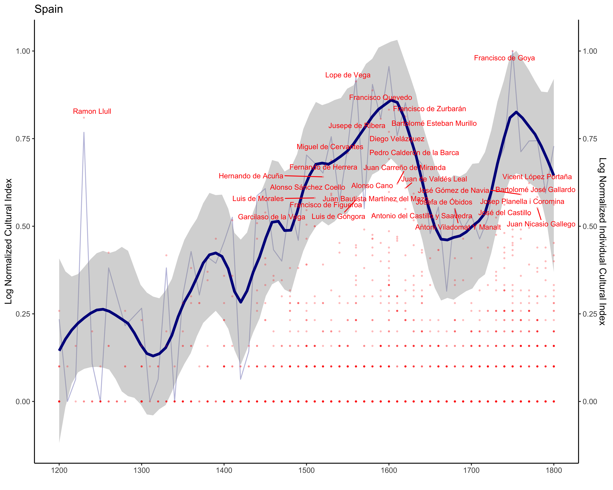

# Cultura Project

For more information about the dababase, you can find information [here](docs/database_description.md).
For more information about the Unseen Species Model, you can find information [here](docs/unseen_model.md).

### Trend Analysis

- Visualisation of the Number of individuals per decade with Rscript

- Visualisation of the Number of works per decade with Rscript

### Environement variables

In the env file, add the path to the cultural_1.db (DB_PATH = 'PATH_TO_CULTURA_1.0_DB')

Then, change the file into an environement variable

```bash
pip install python-dotenv # install dot-env package
cp env .env

```

### Visualisation of the trends

Change the paramter at the beginning of the [plot_trend R script](r_visual_scripts/plot_trend.R) and display graph with the following command:

```bash
python src/run_trends.py
# output --> data/
Rscript r_visual_scripts/plot_trend.R # call the Rscript
# output --> test.png

```

- The blue line is the loess regression on the number of works per decade. The scale has been normalized between 0 and 1 where 1 is the higest point on the graph.

- The red dots at individuals. Their score is based on how much works who know they haev done. Everything has been normalizd bewteen 0 and 1 where 1 is the individual with the higest number of works on the graph.


