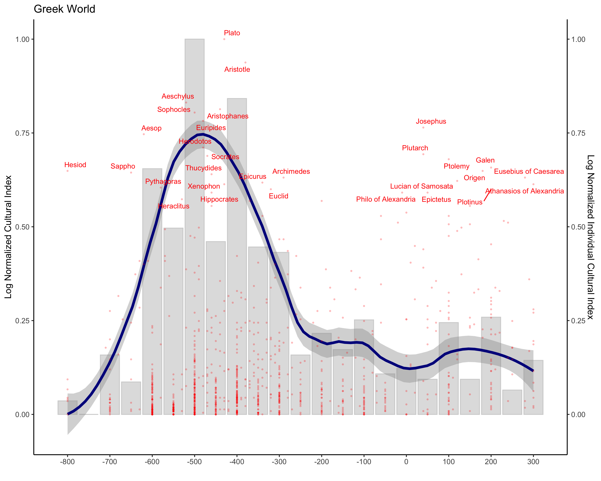

# Cultura Project

## Implementation

The Cultural 1.0 Database can be downloaded on the [OSF Forum](https://osf.io/2euxr/)

In the env file, add the path to the cultural_1.db (DB_PATH = 'PATH_TO_CULTURA_1.0_DB')

Then, change the file into an environement variable

```bash
pip install python-dotenv # install dot-env package
cp env .env
```

## Database Extraction and ETL Pipeline

For more information on the extraction  process of data, find information [here](docs/data_extraction.md)
For more information about the dababase, you can find information [here](docs/database_description.md).

## Immaterial Production

- Regions' Immaterial scores are made with [notebooks/make_region_score.ipynb](notebooks/make_region_score.ipynb).The Score of a region is the number of individuals born in that region and referenced in an online catalog.

- Individuals' Immaterial scores are made with [notebooks/make_individuals_score.ipynb](notebooks/make_individuals_score.ipynb).The Score of an indiviudal is the number of references in online catalogs. For instance Leo Tolstoy as a score of 52 because he exists in the Online Catalogs of 52 different countries.

To visualize the  figures, call the following R function. You can Change the parameters at the beginning of the [plot_trend R script](figures_trends_R/index.R). To visualize two trends at the same time, use [figures_trends_R/index.R](figures_trends_R/index_comparison.R)

```bash
Rscript figures_trends_R/functions.R
```



- The blue line is the loess regression on the number of works per decade. The scale has been normalized between 0 and 1 where 1 is the higest point on the graph.

- The red dots at individuals. Their score is based on the number of online catalogs they appear on.

Both scores have been normalizd bewteen 0 and 1 where 1 is the highest value on the current graph for both score.

## Unseen Species Model

Run [src/run_trends_works.py](src/run_trends_works.py) to create the .csv file [data/df_indi_works.csv](data/df_indi_works.csv). For the model, when an individual has not work mentionned anywhere, we kept the individual and assigned the value 0.

Then run [unseen_species_model/regression.ipynb](unseen_species_model/regression.ipynb)
The notebook output the following [file](unseen_species_model/estimations-per-region-3072023.csv)

## Bayesian Statistics

1) Run the following script [stats_correlation/make_stats.ipynb](stats_correlation/make_stats.ipynb) to create the file [stats_correlation/data_stats_filtered.csv](stats_correlation/data_stats_filtered.csv).

2) Run [bayesian_statistics/BRM.ipynb](bayesian_statistics/BRM.ipynb) to launch the analysis
