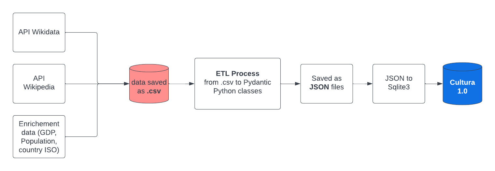

# Cultura 1.0 Database

## Overview

Cultura 1.0 is a database that contains information on Artists & Scientists born before 1850 from different authority files such as GND, VIAF, The Library of Congress etc.

The Database is designed to provide a comprehensive collection of structured information about various cultural entities such as artists, scientists and their works, as well as enriched data about their country of origins.

The data is organized in a SQLite3 format, making it easy to query and retrieve relevant information.

## Data Extraction

The database is a mix of data coming from Wikidata, Wikipedia and enriched Data from other sources.



The ETL Process is in the directory [raw_to_db](../raw_to_db/) where the main function is in the enricher_pipeline.py. The inputs are data as .csv.

The Transformation from JSON pydantic Datamodel to the final Sqlite3 Database is in the notebook [json_to_db.ipynb](../raw_to_db/json_to_db.ipynb).

### Data Extracted from Wikidata

Data are extracted for:

- Individuals
- Work of individuals
- Meta-data such as the Countries given a specifi geolocalisation

The scripts regarding the Wikidata Extraction can be found [here](../scraping/individuals/wikidata/)

The processus of extraction has been carried as followed:

1) Extraction of sub-occupation belonging to writer, scientist or artists as of June 2023 (the ontology evolves regularly).
2) Extraction of individuals and their meta-data (birth place, name, Catalog Identifiers, see description in the database creation) belonging to at least one of those occupations.
3) Extraction of meta-data of indiviudals'information (such as the country of the birth place or a nationality)
4) Extraction of sitelinks information (link to wikipedia pages).

Data have been extracted using [SPARQLWrapper](https://sparqlwrapper.readthedocs.io/en/latest/ ) given that Wikidata can be queries as a SQPARQL database.

### Data Extracted from Wikipedia

The scripts regarding the Wikidata Extraction can be found [here](../scraping/individuals/wikipedia/)

Initially information about individuals have been extracted from Wikipedia, using the Wikipedia API though python.

### Data Enriched for Population & GDP per capita

The GDP per capita & Population are added thought the following notebook [raw_to_db/insert_gdp_population_to_db.ipynb](../raw_to_db/insert_gdp_population_to_db.ipynb).

Population data is interpolatated for every decade.

To get information on how regions are associated to countries, check the [Google Sheet](<https://docs.google.com/spreadsheets/d/1MGNzF-CcGMDkyYR0M1CS2lzJrGc4bGDVR9zj7H68uA8/edit#gid=1495995572>)

## Features

- Authority files data extracted fromthe Wikidata Portal
- Comprehensive information about cultural & scientific entities
- SQLite3 format for easy querying and integration
- Manually Enriched

## Database Structure

The Cultura 1.0 database follows a relational structure, with tables representing different entities and their attributes. Here is an overview of the main tables:

The merging of the id is carried out thanks to the Wikidata_id of entities.

- `individual_gender`: store information about the gender of individuals.
- `individual_nationality`: store information about the gender of individuals.
- `individual_birthcity`: store information about the birthcity of individuals.
- `birthcity`: store information about meta-data of  birthcities (location, country etc).
- `individual_identifiers`: store information about Authority Files Identifiers of individuals.
- `individual_wikipedia`: store information Wikipedia Page in 280 language of individuals.
- `individual_occupations`: store information about the occupations of individuals.
- `individuals_main_information`: store information about main information about individuals (birthyear, cleaned country of origin).
- `individuals_regions`: store information about the regions an individual belongs to.
- `individual_viaf_id`: store information about the VIAF Id of individuals.
- `country_continent`: store information about country and continents and their wikidata ids.
- `individual_created_work`: store information the different works of individuals.
- `identifiers`: store information the meta-data of Authority Files.
- `created_work_identifiers`: store information about Authority Files Identifiers of works.
- `created_work`: store information about the meta-data of individuals' works.
- `notable_work`: store information about the meta-data of individuals' notable
- `gpd`: store information about the GDP per capita of main regions
- `population`: store information about the population of main regions

## Installation

Install SQLite3 on your system if it's not already installed.

```shell
pip install sqlite3
```

## Examples

```python
import sqlite3
import pandas as pd

conn = sqlite3.connect('cultura_1.db')

# Chose a table to extract
table_name = 'individuals_main_information'

# Load the table as a pandas DataFrame
df = pd.read_sql_query(f"SELECT * FROM {table_name}", conn)
```
